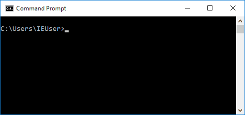
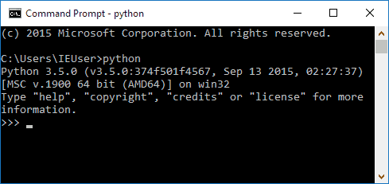

第一个Python程序  
________________________________________  
现在，了解了如何启动和退出Python的交互式环境，我们就可以正式开始编写Python代码了。  
在写代码之前，请千万不要用“复制”-“粘贴”把代码从页面粘贴到你自己的电脑上。写程序也讲究一个感觉，你需要一个字母一个字母地把代码自己敲进去，在敲代码的过程中，初学者经常会敲错代码，所以，你需要仔细地检查、对照，才能以最快的速度掌握如何写程序。  
  
在交互式环境的提示符>>>下，直接输入代码，按回车，就可以立刻得到代码执行结果。  
现在，试试输入100+200，看看计算结果是不是300：  
\>>> 100+200  
300  
很简单吧，任何有效的数学计算都可以算出来。  
如果要让Python打印出指定的文字，可以用print()函数，然后把希望打印的文字用单引号或者双引号括起来，但不能混用单引号和双引号：  
\>>> print('hello, world')  
hello, world  
这种用单引号或者双引号括起来的文本在程序中叫字符串，今后我们还会经常遇到。  
最后，用exit()退出Python，我们的第一个Python程序完成！唯一的缺憾是没有保存下来，下次运行时还要再输入一遍代码。
  
命令行模式和Python交互模式  
请注意区分命令行模式和Python交互模式。  

看到类似C:\>是在Windows提供的命令行模式：  
  
在命令行模式下，可以执行python进入Python交互式环境，也可以执行python hello.py运行一个.py文件。  

看到>>>是在Python交互式环境下：  
  
在Python交互式环境下，只能输入Python代码并立刻执行。  

此外，在命令行模式运行.py文件和在Python交互式环境下直接运行Python代码有所不同。Python交互式环境会把每一行Python代码的结果自动打印出来，但是，直接运行Python代码却不会。  
例如，在Python交互式环境下，输入：  
\>>> 100 + 200 + 300  
600  
直接可以看到结果600。  
但是，写一个calc.py的文件，内容如下：  
100 + 200 + 300  
然后在命令行模式下执行：  
C:\work>python calc.py  
发现什么输出都没有。  
这是正常的。想要输出结果，必须自己用print()打印出来。把calc.py改造一下：  
print(100 + 200 + 300)  
再执行，就可以看到结果：  
C:\work>python calc.py  
600  

小结  
在Python交互式命令行下，可以直接输入代码，然后执行，并立刻得到结果。