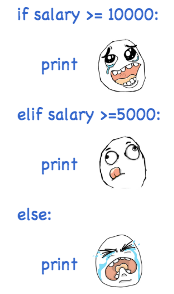

条件判断  
________________________________________  
条件判断  
计算机之所以能做很多自动化的任务，因为它可以自己做条件判断。  
比如，输入用户年龄，根据年龄打印不同的内容，在Python程序中，用if语句实现：  

	age = 20  
	if age >= 18:  
	　　print('your age is', age)  
	　　print('adult')  
根据Python的缩进规则，如果if语句判断是True，就把缩进的两行print语句执行了，否则，什么也不做。  
也可以给if添加一个else语句，意思是，如果if判断是False，不要执行if的内容，去把else执行了：  

	age = 3  
	if age >= 18:  
	　　print('your age is', age)  
	　　print('adult')  
	else:  
	　　print('your age is', age)  
	　　print('teenager')  
注意不要少写了冒号:。  
当然上面的判断是很粗略的，完全可以用elif做更细致的判断：  

	age = 3  
	if age >= 18:  
	　　print('adult')  
	elif age >= 6:  
	　　print('teenager')  
	else:  
	　　print('kid')  
elif是else if的缩写，完全可以有多个elif，所以if语句的完整形式就是：  

	if <条件判断1>:  
	　　<执行1>  
	elif <条件判断2>:  
	　　<执行2>  
	elif <条件判断3>:  
	　　<执行3>  
	else:  
	　　<执行4>  
if语句执行有个特点，它是从上往下判断，如果在某个判断上是True，把该判断对应的语句执行后，就忽略掉剩下的elif和else，所以，请测试并解释为什么下面的程序打印的是teenager：  

	age = 20  
	if age >= 6:  
	　　print('teenager')  
	elif age >= 18:  
	　　print('adult')  
	else:  
	　　print('kid')  
if判断条件还可以简写，比如写：  

	if x:  
	　　print('True')  
只要x是非零数值、非空字符串、非空list等，就判断为True，否则为False。  

再议 input  
最后看一个有问题的条件判断。很多同学会用input()读取用户的输入，这样可以自己输入，程序运行得更有意思：  

	birth = input('birth: ')  
	if birth < 2000:  
	　　print('00前')  
	else:  
	　　print('00后')  
输入1982，结果报错：  

	Traceback (most recent call last):  
	　File "<stdin>", line 1, in <module>  
	TypeError: unorderable types: str() > int()  
这是因为input()返回的数据类型是str，str不能直接和整数比较，必须先把str转换成整数。Python提供了int()函数来完成这件事情：  

	s = input('birth: ')  
	birth = int(s)  
	if birth < 2000:  
	　　print('00前')  
	else:  
	　　print('00后')  
再次运行，就可以得到正确地结果。但是，如果输入abc呢？又会得到一个错误信息：  

	Traceback (most recent call last):  
	　File "<stdin>", line 1, in <module>  
	ValueError: invalid literal for int() with base 10: 'abc'  
原来int()函数发现一个字符串并不是合法的数字时就会报错，程序就退出了。  
如何检查并捕获程序运行期的错误呢？后面的错误和调试会讲到。  

练习  
小明身高1.75，体重80.5kg。请根据BMI公式（体重除以身高的平方）帮小明计算他的BMI指数，并根据BMI指数：  
•	低于18.5：过轻  
•	18.5-25：正常  
•	25-28：过重  
•	28-32：肥胖  
•	高于32：严重肥胖  
用if-elif判断并打印结果：  

	# -*- coding: utf-8 -*-  
	
	height = 1.75  
	weight = 80.5  

小结  
条件判断可以让计算机自己做选择，Python的if...elif...else很灵活。  
  