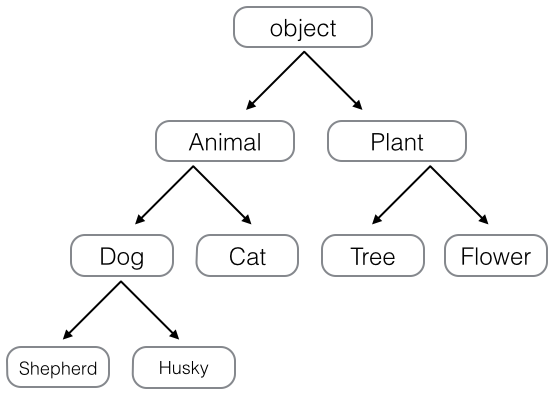

##继承和多态  
在OOP程序设计中，当我们定义一个class的时候，可以从某个现有的class继承，新的class称为子类（Subclass），而被继承的class称为基类、父类或超类（Base class、Super class）。  
比如，我们已经编写了一个名为Animal的class，有一个run()方法可以直接打印：
class Animal(object):
    def run(self):
        print('Animal is running...')  
当我们需要编写Dog和Cat类时，就可以直接从Animal类继承：

	class Dog(Animal):
	    pass
	
	class Cat(Animal):
	    pass  
对于Dog来说，Animal就是它的父类，对于Animal来说，Dog就是它的子类。Cat和Dog类似。  
继承有什么好处？最大的好处是子类获得了父类的全部功能。由于Animial实现了run()方法，因此，Dog和Cat作为它的子类，什么事也没干，就自动拥有了run()方法：  

	dog = Dog()
	dog.run()
	
	cat = Cat()
	cat.run()
运行结果如下：

	Animal is running...
	Animal is running...  
当然，也可以对子类增加一些方法，比如Dog类：

	class Dog(Animal):
	
	    def run(self):
	        print('Dog is running...')
	
	    def eat(self):
	        print('Eating meat...')  
继承的第二个好处需要我们对代码做一点改进。你看到了，无论是Dog还是Cat，它们run()的时候，显示的都是Animal is running...，符合逻辑的做法是分别显示Dog is running...和Cat is running...，因此，对Dog和Cat类改进如下：  

	class Dog(Animal):
	
	    def run(self):
	        print('Dog is running...')
	
	class Cat(Animal):
	
	    def run(self):
	        print('Cat is running...') 
再次运行，结果如下：

	Dog is running...
	Cat is running...  
当子类和父类都存在相同的run()方法时，我们说，子类的run()覆盖了父类的run()，在代码运行的时候，总是会调用子类的run()。这样，我们就获得了继承的另一个好处：多态。  
要理解什么是多态，我们首先要对数据类型再作一点说明。当我们定义一个class的时候，我们实际上就定义了一种数据类型。我们定义的数据类型和Python自带的数据类型，比如str、list、dict没什么两样：

	a = list() # a是list类型
	b = Animal() # b是Animal类型
	c = Dog() # c是Dog类型  
判断一个变量是否是某个类型可以用isinstance()判断：

	>>> isinstance(a, list)
	True
	>>> isinstance(b, Animal)
	True
	>>> isinstance(c, Dog)
	True  
看来a、b、c确实对应着list、Animal、Dog这3种类型。
但是等等，试试：

	>>> isinstance(c, Animal)
	True  
看来c不仅仅是Dog，c还是Animal！
不过仔细想想，这是有道理的，因为Dog是从Animal继承下来的，当我们创建了一个Dog的实例c时，我们认为c的数据类型是Dog没错，但c同时也是Animal也没错，Dog本来就是Animal的一种！  
所以，在继承关系中，如果一个实例的数据类型是某个子类，那它的数据类型也可以被看做是父类。但是，反过来就不行：

	>>> b = Animal()
	>>> isinstance(b, Dog)
	False  
Dog可以看成Animal，但Animal不可以看成Dog。  
要理解多态的好处，我们还需要再编写一个函数，这个函数接受一个Animal类型的变量：

	def run_twice(animal):
	    animal.run()
	    animal.run()
当我们传入Animal的实例时，run_twice()就打印出：

	>>> run_twice(Animal())
	Animal is running...
	Animal is running...
当我们传入Dog的实例时，run_twice()就打印出：

	>>> run_twice(Dog())
	Dog is running...
	Dog is running...
当我们传入Cat的实例时，run_twice()就打印出：

	>>> run_twice(Cat())
	Cat is running...
	Cat is running...  
看上去没啥意思，但是仔细想想，现在，如果我们再定义一个Tortoise类型，也从Animal派生：

	class Tortoise(Animal):
	    def run(self):
	        print('Tortoise is running slowly...')  
当我们调用`run_twice()`时，传入Tortoise的实例：

	>>> run_twice(Tortoise())
	Tortoise is running slowly...
	Tortoise is running slowly...
你会发现，新增一个Animal的子类，不必对`run_twice()`做任何修改，实际上，任何依赖Animal作为参数的函数或者方法都可以不加修改地正常运行，原因就在于多态。  
多态的好处就是，当我们需要传入Dog、Cat、Tortoise……时，我们只需要接收Animal类型就可以了，因为Dog、Cat、Tortoise……都是Animal类型，然后，按照Animal类型进行操作即可。由于Animal类型有run()方法，因此，传入的任意类型，只要是Animal类或者子类，就会自动调用实际类型的run()方法，这就是多态的意思：  
对于一个变量，我们只需要知道它是Animal类型，无需确切地知道它的子类型，就可以放心地调用run()方法，而具体调用的run()方法是作用在Animal、Dog、Cat还是Tortoise对象上，由运行时该对象的确切类型决定，这就是多态真正的威力：调用方只管调用，不管细节，而当我们新增一种Animal的子类时，只要确保run()方法编写正确，不用管原来的代码是如何调用的。这就是著名的“开闭”原则：  
对扩展开放：允许新增Animal子类；  
对修改封闭：不需要修改依赖Animal类型的run_twice()等函数。  
继承还可以一级一级地继承下来，就好比从爷爷到爸爸、再到儿子这样的关系。而任何类，最终都可以追溯到根类object，这些继承关系看上去就像一颗倒着的树。比如如下的继承树：  
  
###静态语言vs动态语言  
对于静态语言（例如Java）来说，如果需要传入Animal类型，则传入的对象必须是Animal类型或者它的子类，否则，将无法调用run()方法。  
对于Python这样的动态语言来说，则不一定需要传入Animal类型。我们只需要保证传入的对象有一个run()方法就可以了：  

	class Timer(object):
	    def run(self):
	        print('Start...')

	>>>e = Timer()
	>>>run_twice(e)
	Start...
	Start...	
这就是动态语言的“鸭子类型”，它并不要求严格的继承体系，一个对象只要“看起来像鸭子，走起路来像鸭子”，那它就可以被看做是鸭子。  
Python的`“file-like object“`就是一种鸭子类型。对真正的文件对象，它有一个read()方法，返回其内容。但是，许多对象，只要有read()方法，都被视为`“file-like object“`。许多函数接收的参数就是`“file-like object“`，你不一定要传入真正的文件对象，完全可以传入任何实现了read()方法的对象。  
###小结  
继承可以把父类的所有功能都直接拿过来，这样就不必重零做起，子类只需要新增自己特有的方法，也可以把父类不适合的方法覆盖重写。  
动态语言的鸭子类型特点决定了继承不像静态语言那样是必须的。  
