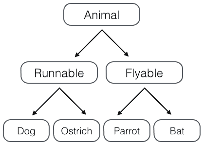

##多重继承  
继承是面向对象编程的一个重要的方式，因为通过继承，子类就可以扩展父类的功能。
回忆一下Animal类层次的设计，假设我们要实现以下4种动物：  
Dog - 狗狗；  
Bat - 蝙蝠；  
Parrot - 鹦鹉；  
Ostrich - 鸵鸟。  
如果按照哺乳动物和鸟类归类，我们可以设计出这样的类的层次：  
  
但是如果按照“能跑”和“能飞”来归类，我们就应该设计出这样的类的层次：  
  
如果要把上面的两种分类都包含进来，我们就得设计更多的层次：  
哺乳类：能跑的哺乳类，能飞的哺乳类；  
鸟类：能跑的鸟类，能飞的鸟类。  
这么一来，类的层次就复杂了：  
  
如果要再增加“宠物类”和“非宠物类”，这么搞下去，类的数量会呈指数增长，很明显这样设计是不行的。  
正确的做法是采用多重继承。首先，主要的类层次仍按照哺乳类和鸟类设计：

	class Animal(object):
	    pass
	
	# 大类:
	class Mammal(Animal):
	    pass
	
	class Bird(Animal):
	    pass
	
	# 各种动物:
	class Dog(Mammal):
	    pass
	
	class Bat(Mammal):
	    pass
	
	class Parrot(Bird):
	    pass
	
	class Ostrich(Bird):
	    pass  
现在，我们要给动物再加上Runnable和Flyable的功能，只需要先定义好Runnable和Flyable的类：

	class Runnable(object):
	    def run(self):
	        print('Running...')
	
	class Flyable(object):
	    def fly(self):
	        print('Flying...')  
对于需要Runnable功能的动物，就多继承一个Runnable，例如Dog：  

	class Dog(Mammal, Runnable):
	    pass
对于需要Flyable功能的动物，就多继承一个Flyable，例如Bat：

	class Bat(Mammal, Flyable):
	    pass
通过多重继承，一个子类就可以同时获得多个父类的所有功能。  

	>>> dog=Dog()
	>>> dog.run()
	Running...
	>>> bat=Bat()
	>>> bat.fly()
	Flying...  
###MixIn  
在设计类的继承关系时，通常，主线都是单一继承下来的，例如，Ostrich继承自Bird。但是，如果需要“混入”额外的功能，通过多重继承就可以实现，比如，让Ostrich除了继承自Bird外，再同时继承Runnable。这种设计通常称之为MixIn。  
为了更好地看出继承关系，我们把Runnable和Flyable改为RunnableMixIn和FlyableMixIn。类似的，你还可以定义出肉食动物CarnivorousMixIn和植食动物HerbivoresMixIn，让某个动物同时拥有好几个MixIn：  

	class Dog(Mammal, RunnableMixIn, CarnivorousMixIn):
	    pass  
MixIn的目的就是给一个类增加多个功能，这样，在设计类的时候，我们优先考虑通过多重继承来组合多个MixIn的功能，而不是设计多层次的复杂的继承关系。  
Python自带的很多库也使用了MixIn。举个例子，Python自带了TCPServer和UDPServer这两类网络服务，而要同时服务多个用户就必须使用多进程或多线程模型，这两种模型由ForkingMixIn和ThreadingMixIn提供。通过组合，我们就可以创造出合适的服务来。  
比如，编写一个多进程模式的TCP服务，定义如下：

	class MyTCPServer(TCPServer, ForkingMixIn):
	    pass  
编写一个多线程模式的UDP服务，定义如下：

	class MyUDPServer(UDPServer, ThreadingMixIn):
	    pass  
如果你打算搞一个更先进的协程模型，可以编写一个CoroutineMixIn：

	class MyTCPServer(TCPServer, CoroutineMixIn):
	    pass  
这样一来，我们不需要复杂而庞大的继承链，只要选择组合不同的类的功能，就可以快速构造出所需的子类。  
###小结  
由于Python允许使用多重继承，因此，MixIn就是一种常见的设计。
只允许单一继承的语言（如Java）不能使用MixIn的设计。  
###问题
1.我发现当多重继承的时候，两个父类定义的slots不同会发生错误，但是如果一个父类没有定义slots则不会发生错误，而且在这种情况下似乎slots没有起到限定作用  

	class Person(object):
	    __slots__ = ('__name','__sexy','__studentnum')
	    def __init__(self,name,sexy):
	        self.__name = name
	        self.__sexy = sexy
	
	    def getname(self):
	        print("This person's name is:%s." % self.__name)
	
	    def getsexy(self):
	        print("This person is a %s." % self.__sexy)
	
	    def setname(self,newname):
	        self.__name = newname
	        print("This person's new name is:%s." % self.__name)
	
	class Student(object):
	    __slots__ = ('__name','__studentnum','__sexy')
	    def __init__(self,name,studentnum):
	        self.__name = name
	        self.__studentnum = studentnum
	
	    def getname(self):
	        print("This student's name is:%s." % self.__name)
	
	    def getstudentnum(self):
	        print("This student's number is:%s." % self.__studentnum)
	
	class Person_Student(Person,Student):
	    pass
当两个父类的slots完全相同的时候还是会出现冲突报错，这是为什么呢，求大神指点。在多重继承的时候不能再父类使用slots吗  
----有了slots就别继承了，不要自己给自己找麻烦  
----使用slots要注意，slots定义的属性仅对当前类实例起作用，对继承的子类是不起作用的,如果子类中也定义slots，这样，子类实例允许定义的属性就是自身的slots加上父类的slots，如果子类中没有定义slots，父类的slots不会对子类造成影响，我测试了一下，没有错误  

2.那么问题来了，多个父类有重复的成员方法，那么子类到底继承哪一个捏，还是说必须要重写？  

	class Person(object):
	  def run(self):
	     print('running man!')
	
	class Dog(object):
	  def run(self):
	    print('running 汪!')
	
	class Monster(Dog, Person):
	  pass
	
	xueFengSaiSai = Monster()
	xueFengSaiSai.run()
结果是：running 汪！  
如上测试得到的结论是，如果多个父类包含相同的成员方法，那么子类只会继承第一个父类的成员方法。  
----友情抛砖：子类继承的是子类参数里的第一个父类，而不是最高父类person。如果把monster()中person放前面则继承person。  
